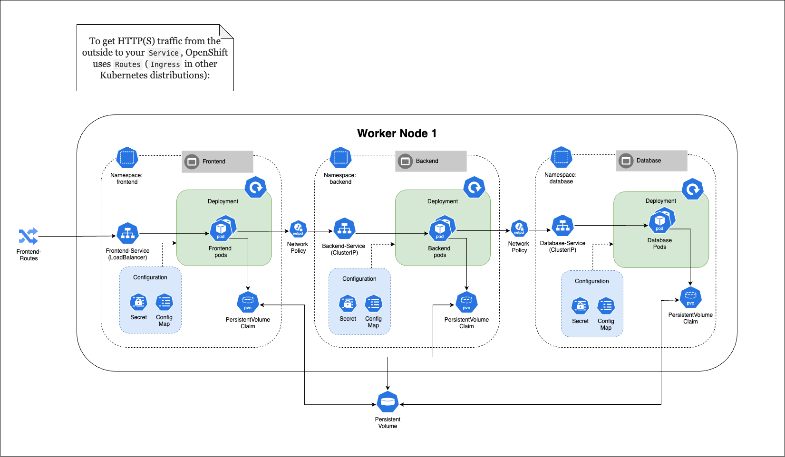

# JPE Helm Chart

## Architecture Diagram

<a href title="Chisel Architecture Diagram"></a>

## Overview

This Helm chart provides a template for deploying applications on OpenShift. It includes the necessary Kubernetes resources and configurations for the deployment into JPE Environment.

## Prerequisites

* An active OpenShift cluster (local or remote)
* `oc` command-line tool installed and configured
* Helm CLI (version 3.x or later)
* Access to container registry hosting the application images (To be confirmed)

## Configuration

All configuration options are documented in the [values.yaml](values.yaml) file. Key configuration parameters include:

* `image.repository`: Container image repository
* `image.tag`: Container image tag
* `image.pullPolicy`: Image pull policy
* `resources`: CPU/Memory resource requests and limits
* `replicaCount`: Number of pod replicas
* `service.port`: Service port configuration
* `env`: Environment variables for the containers

## Local Deployment Instructions

### 1. Access OpenShift Cluster

```bash
# Start OpenShift cluster (if using CodeReady Containers)
crc start

# Configure OpenShift CLI
eval $(crc oc-env)

# Login to cluster
oc login -u developer -p developer  # Use your credentials
```

### 2. Create Project

```bash
oc new-project <project_name>
# Example: oc new-project myapp
```

### 3. Package Chart

```bash
cd .. # Navigate to directory above mychart
helm package <chart_directory>
# Example: helm package mychart
```

### 4. Deploy Chart

For initial installation:

```bash
helm install <release_name> <chart_archive> -f <values_file>
# Example: helm install myapp mychart-0.1.0.tgz -f mychart/values.yaml
```

For upgrading existing deployment:

```bash
helm upgrade <release_name> <chart_archive> -f <values_file>
# Example: helm upgrade myapp mychart-0.1.0.tgz -f mychart/values.yaml
```

## Deployment Vertification

After deployment, verify the installation:

```bash
# Check pod status
oc get pods

# Check services
oc get services

# Check deployments
oc get deployments
```